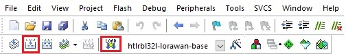

# HTLRBL32- Web Platform (TagoIO)

## Web Platform Monitoring Application

Web Platform Monitoring Application is a web interface example which presents the data received from a HTLRBL32 device in a LoRaWAN network (The Things Network) in a cloud interface service (TigoIO). 

Through this application, users will be able to create their own LoRaWAN web platform interface.

## Application Description

Web Platform Monitoring Application starts configuring some necessary peripherals, like USART1 (log purposes), GPIOs (radio interruption, etc.) and I2C (communication with HTS221 and LSP22HB sensors). 

More code details can be found reading the comments written in all header files available in this application.

## Test Setup

This section describes the basic test setup to running this application.

* [Git](https://git-scm.com/downloads).
* [uVision IDE](https://www2.keil.com/mdk5).
* RS232 terminal ([Termite](https://www.compuphase.com/software_termite.htm) is recommended).
* [ST-Link Debugger](https://www.st.com/en/development-tools/st-link-v2.html) to flash a firmware.
* HTLRBL32 device.
* Semtech SX1308 LoRa® Gateway.
* HTS221 (temperature and humidity) and LSP22HB (pressure) I2C sensors.
* FTDI (usb-serial converter – one for each device).

# Executing

1. Clone the master branch: <br/>

```
git clone --single-branch --branch master_2 https://github.com/henriquekuhn/HTLRBL32.git
```

2. Open "Lora TagoIO interface\LoRaWAN-Base\MDK-ARM\HTLRBL32L" directory and then, double click htlrbl32l-lorawan-base.uvprojx file to open uVision. 
3. Click *Build* to compile and *Load* ti flash the new firmware into your device: <br/>

<div align="center">
  
</div>

<br/>

4. Open Termite and reset your device to check if the initial string was printed on serial. <br/>

<div align="center">
  
</div>


## The Things Network (TTN)

- Create a TTN account and follow "[Adding TN gateway guide]"(https://git-scm.com/downloads) steps to add a new gateway. <br/>

## Extra Documentation

Datasheets and application notes can be found at the [HTLRBL32 Repository](https://github.com/htmicron/ht32sx).

## References

For additional information about S2LP or even more applications developed with this transceiver, check [S2LP Datasheet](https://www.st.com/resource/en/datasheet/s2-lp.pdf) and the [UM1904](https://www.st.com/resource/en/user_manual/dm00189294-getting-started-with-xcubesubg1-sub1-ghz-rf-software-expansion-for-stm32cube-stmicroelectronics.pdf) user manual written by STMicroelectronics.


## Contact Information

Head Office – São Leopoldo, RS <br/>
HT Micron Semiconductors <br/>
Unisinos Avenue, 1550 <br/>
São Leopoldo - RS <br/>
ZIP 93022-750 <br/>
Brazil <br/>
Tel: +55 51 3081-8650 <br/>
E-mail (Support): support_iot@htmicron.com.br <br/>
E-mail (General Enquiries): htmicron@htmicron.com.b <br/>